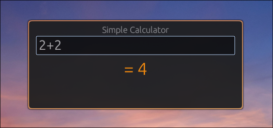

# HyprCalculator

A **simple, tiny, floating, always-focused calculator** built in Rust for **Arch Linux + Hyprland**.

Perfect for quick math without leaving your workflow.

---

  

---

## Features

- **Enter = calculate**
- **Esc = clear**
- **Ctrl+C = copy result**
- **Parentheses supported** (`(2+3)*4`)
- **Big, bright orange result**
- **Auto-focus on open**
- **Zero dependencies** — just run the binary

---

## Download Binary

> **Linux x86_64 only** (statically linked)

```bash
wget https://github.com/yourusername/HyprCalculator/releases/latest/download/HyprCalculator
chmod +x HyprCalculator
```
Or grab it from Releases

---

## How to Run

```bash
./HyprCalculator
```
Or install globally:

```bash
sudo mv HyprCalculator /usr/local/bin/HyprCalculator
```
Now run with:

```bash
HyprCalculator
```

---

## Hyprland Setup

Add to `~/.config/hypr/hyprland.conf`:

```conf
# Floating Calculator
bind = SUPER, C, exec, HyprCalculator

windowrulev2 = float,title:^(Rust Calculator)$
windowrulev2 = center,title:^(Rust Calculator)$
windowrulev2 = size 460 200,title:^(Rust Calculator)$
```

Reload Hyprland (usually Hyprland auto-reloads):

```bash
hyprctl reload
```
Now press Super + C → instant calculator.

---

## Build from Source (Optional)

```bash
git clone https://github.com/yourusername/HyprCalculator.git
cd HyprCalculator
cargo run --release
```
Binary will be in `target/release/HyprCalculator`

---

## Disclaimer

Use at your own risk.  
I take no responsibility for anything this does or doesn't do.  
It’s a simple calculator made in a few hours. That’s it.

---

## Made With

- Rust  
- egui

Enjoy fast math.
